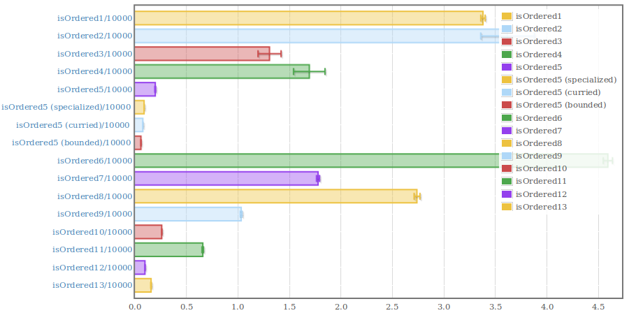

# Benchmark of Joachim Breitner's Haskell Love Talk

I watched Joachim Breitner's Haskell Love talk today. He starts with a high level specification of a program that checks if a binary tree is ordered. During the talk he develops many different implementations. I thought that it would be interesting to see how fast all the different implementations really are.

Here is the link to the talk: https://vimeo.com/442720683#t=7067s

Breitner's talk starts around 1:57:47.

Currently, I only test the functions on balanced ordered trees with 10000
elements from 0 to 10000.

## Run these yourself

My machine may produce different results than yours.

Find out by cloning this repo and running it with cabal:

```
git clone https://github.com/noughtmare/breitnerbench.git
cd breitnerbench
cabal run -O2 breitnerbench -- -o report.html
xdg-open report.html
```

## On my machine

The fastest is `isOrdered12`, but `isOrdered5` can be specialized to `Int`, the tuple can be changed to two arguments and the max and min bounds can be used instead of using a maybe type.

The slowest is `isOrdered6`.

Here are all the results with GHC 8.10.1 and `-O2`:


